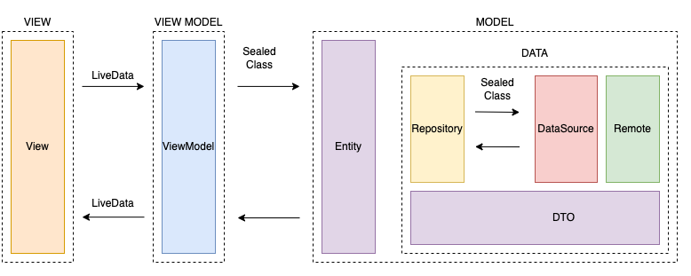

Pokedex is a project that contains a list of pokemons and its details where the latest android technologies are included

<!-- region:description -->

This project aims to meet the challenge of Nisum, in addition to having the implementation of MVVM + Clean Architecture + Dagger hilt + Flow, and android jetpack libraries

<!-- endregion:description -->

## Table of Contents

1. [let's start](#let's start)
2. [Quick Start](#quick-start)
3. [Use and demonstration](#use-and-demonstration)
4. [Compatibility](#compatibility)

## Let us begin

## Quick start

[//]: # 'region:quick-start'

> No additional configuration required

[//]: # 'endregion:quick-start'

## Usage and demo

[//]: # 'region:usage-demo'

[//]: # 'general content diagram'

#### Internal structure

The project included MVVM (Model View ViewModel) architecture pattern was used, coroutines, live data, sealed classes, repository and data sources.

> Navigation should be handled via [**Navigation Component**] (https://developer.android.com/guide/navigation/navigation-getting-started).  
> In case other activities have to be managed, the stack of views must be taken into account to be able to remove them when the project flow ends.

    

If the project starts to grow, it is recommended to use a clean architecture as shown below:

## Compatibilidad

| Min SDK              | Target SDK          | Java     | Kotlin | AGP  |
|----------------------|---------------------|----------|--------|------|
| API 21 (Android 5.0) | API 32 (Android 12) | Java 11+ | 1.7.0  | 7.0+ |